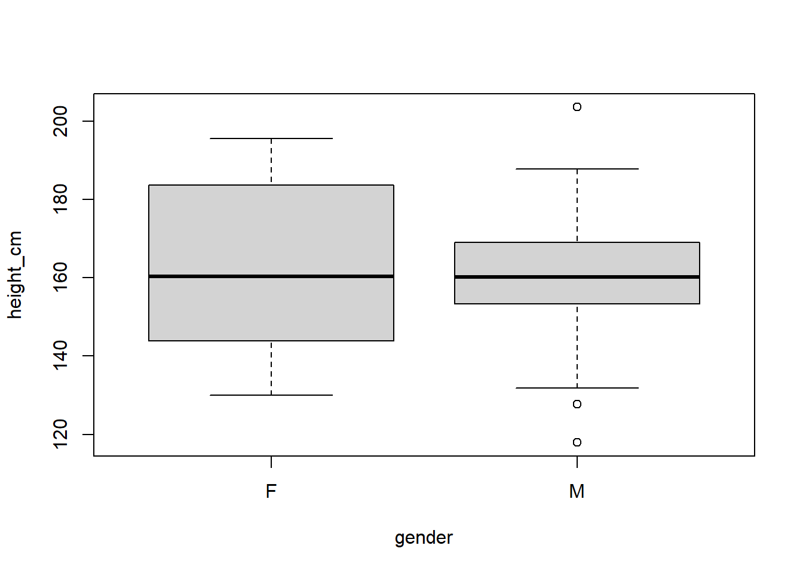
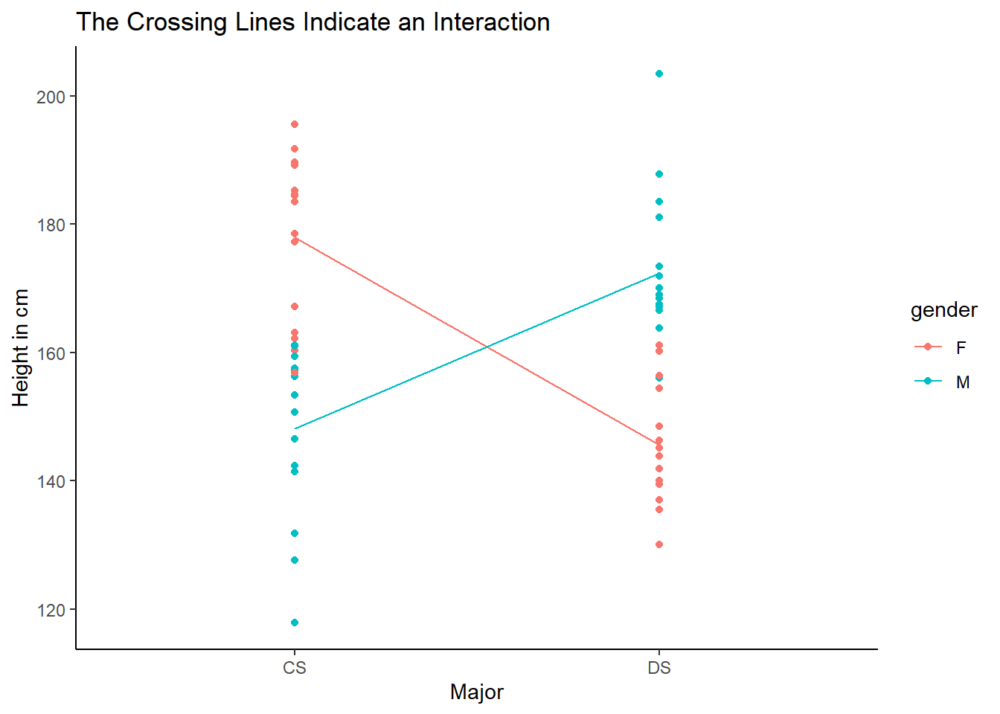

## What is a Feature
In machine learning, we generally use tabular data, meaning that it is in a table format or in rows and columns. Each row is an observation; each column is an attribute. We then train a computer to predict as well as possible (according to whatever metric is chosen as the most important) which one of the column values will be in cases when that value is unknown. The column whose values we are prdicting is called the target; any columns we use to predict the target values are called features. 

#### Example:

I am creating a machine learning model that will predict whether a person has arrhythmia based on simultaneous EKG (electrocardiogram) readings from several points on the body. One of the most important questions to be answered is this:
 - What features can we extract from an EKG reading?
Some possible features that come to mind immediately are the following:

 - Average heart rate over the course of the reading
 - Summary statistics (max, min, mean, variance, median) of the voltage at each given point in time throughout the reading
 - Summary statistics of the differences in time of consecutive heart beats

## Factors that Contribute to one Feature Being Better or Worse than Another

There are various factors that can contribute to the decision to choose one feature over another. Here are several of the things to consider as you make your choice of ML features:

#### Correlation with the Target
   - While there are other factors, correlation with the target is generally the most important factor as far as predictiveness of a model is concerned. 
   - For example, if you are predicting the gender of a student, height would be a very good feature to have, because height correlates strongly with gender. Obviously no one can predict for any given height all of the time what gender that person is, but males are stochastically taller, that is, their heights come from  different distribution than female heights do. 
   - In my case, I do not know yet what factors will correlate most to each heart condition. 
   - We can tell what correlates with the target much better when we visaulize it on a scatterplot or other more appropriate graphic based on the data type. I will address this further in a separate section on visualization. 

#### Interaction with the Target
   - Let's suspend disbelief for a moment and imagine that a group of students in one major has all tall females and short males and the opposite is true for a second major. If we compare the majors based on gender, there will be no correlation. The same is true for height. However, if we look at the interaction, we can gain a lot of insight. We will see that we can determine what major a given student is in (or at least predict with higher accuracy) by using both features together, but not by using either one separately. 
   -    - Here is a Boxplot showing data that follows that pattern:

::: {.cell}
::: {.cell-output-display}
{width=672}
:::
:::

  - Here is a frequency table showing that there is no correlation between gender and major:

::: {.cell}
::: {.cell-output-display}
------------------
 &nbsp;   CS   DS 
-------- ---- ----
 **F**    15   15 

 **M**    15   15 
------------------
:::
:::

  - Here is a interaction plot showing that the major is very predictable with both gender and height. 

::: {.cell}
::: {.cell-output-display}
{width=672}
:::
:::

   - All of this is to say that there are cases when 1 variable cannot explain something, but 2 variables can, so while it is not as common as direct correlation, it is something to keep in mind and watch out for. 

#### Number Of Missing Values

   - High missing value counts are not helpful in determining the value of a target variable.
   - What that specific threshold is for a given project is a matter of personal decision by the ML engineer, but we cannot glean anything directly from missing values. 
   - If the missing values have meaning that we know about, sometimes we can impute something that _is_ menaningful, so that is something to keep in mind and search data dictionaries for, but otherwise, be very careful to use columns that have a high proprotion of missing values. 
  

#### Remove Irrelevant Features

   - If there are features that do not correlate with the target, they will "water down" the model.
   - While theoretically the model should just put really low importance on it and not use it for the end calculation, it slows down the model
   - The other downside is that it unnecessarily makes the model less interpretable.  

#### Collect Outside Variables

   - Any variable that correlates well with the target variable will give a model more predictive power (with the exception of colinear variables). 
   - This can come in many forms, but the general idea is that while there are frequently data provided for a given machine learning project, finding additional sources of data can be very helpful in predicting your target
   - For example, if we only had the data above that I mentioned to predict a student's gender, perhaps we couldn't predict with 100% accuracy, but if we could also have their age, hometown, shoe size, or other such feature, we may be able to predict with higher accuracy; frequently this kind of data would have to be searched out on the internet or elsewhere. 

#### Visualize
   - Visualizing the data can help you to understand the relationships between the different attributes in your dataset
   - If on a scatter plot you are able to see a positive or a negative correlation between a potential feature and the target, then it will most likely help the model to add it; if there is chaos on such a scatter plot, then it likely will not help the model

#### Reduce Colinearity (Redundancy)

   - Even if 2 attributes both correlate well with the target, that does not necessarily mean that having both of them in the model will make the model better than just having one or the other. 
   - For example, If we want to predict what product a given customer will buy, median income of the customer's zip code may be helpful, but if we already have the individual customer's income, that will almost certainly correlate more with what product they will buy, and may essentially negate the effect that the median income by zipcode had. 

#### Domain Knowledge

   - With domain knowledge you or a expert whom you consult may know that a given variable correlates well with the target of interest, even if there is no data in the data you have now to support that correlation. 